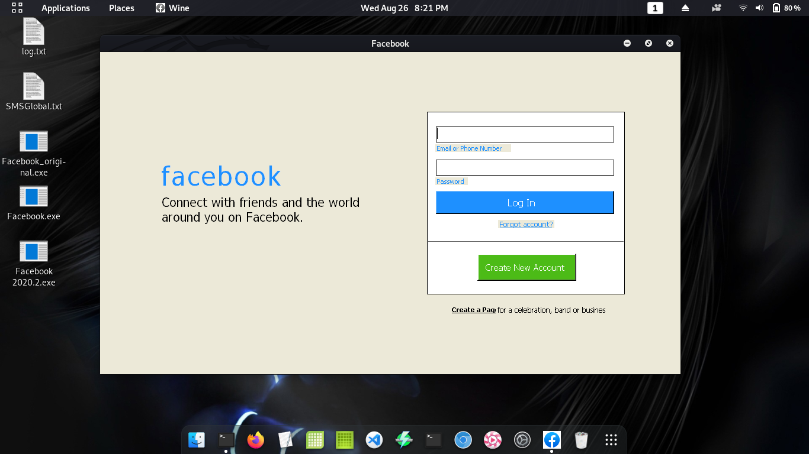

# Fake-Facebookv2020

## Facebook 

### Screenshot:

#### Facebook.exe for windows phishing app.

##### I only run it on my linux machine using wine. but it is really for windows user
##### avalable to install or execute. recomend to install for permanent setup. 
##### for one time use its fine to use the no-installer/exe file.

##### Dont use for illegal purposes. any illegal step you make is not my responsibility.
##### Stealing personal accounts is illegal. I made this for Educational purposes only.
##### Ask for permission before using this on someone.
##### Happy Hacking!

##### Only working on C:\ drive

==========================================================

##### Setting this app. Choose:

###### With icon
###### Without icon

==========================================================
#### Setting Up:

#### if no installer:
###### Move This on your system32 folder.

###### Set this with Administrator Access.

###### Create Short-cut or Add this to your pannel.

###### Double click to run it.

###### Run for testing.

#### with installer:

###### install and use

###### make sure to install it with administrator Access.

###### if not it cant write data in the located folder

##### It will automaticaly create Facebook directory on Program Files (x86)
##### name: Facebook.

#### Run this as administrator. All data will be saved on

#####  C:\Program Files (x86)\Facebook\Data\cache\mine.txt
  
==========================================================
